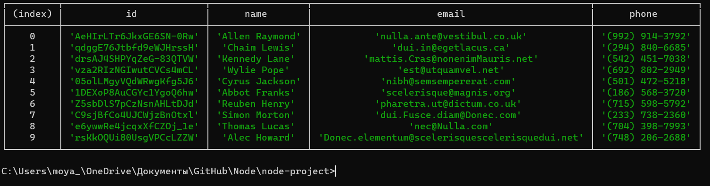
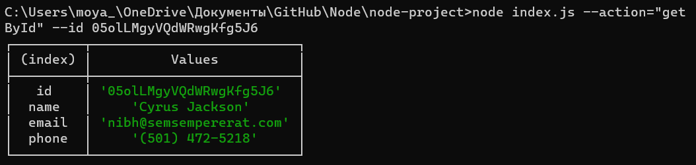
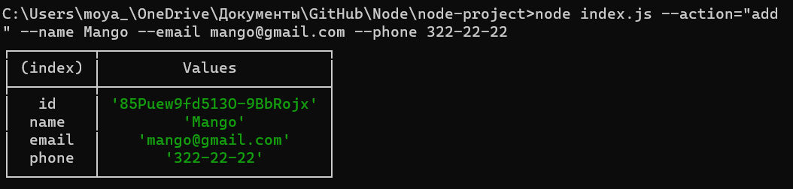
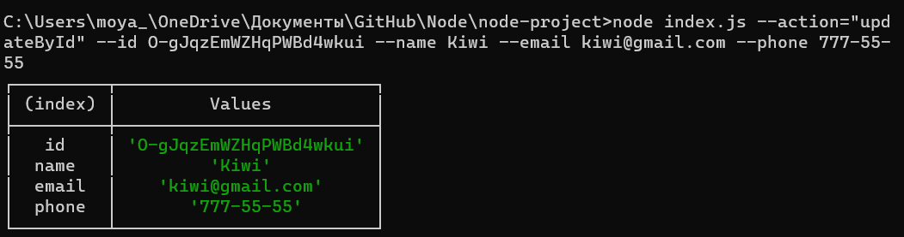
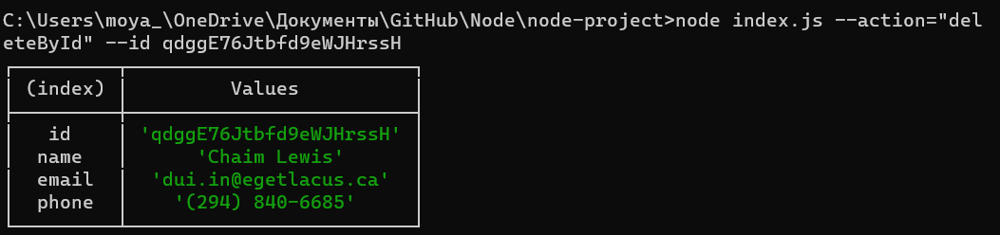

<a id="anchor"></a>

# Виводимо у терміналі:

- **_Отримуємо і виводимо весь список контактів у вигляді таблиці_**

```
  node index.js --action="list"
```

---

[](https://monosnap.com/file/RBPOoNH1mcJeqIZ4QRueow0IApJdAg)

- **_Отримуємо контакт по id і виводимо у консоль об'єкт контакту_**

```
  node index.js --action="get" --id 05olLMgyVQdWRwgKfg5J6
```

---

[](https://monosnap.com/file/3k5H3LMyAfvU4vYDrxdt5s1jadHedZ)

- **_Додаємо контакт та виводимо в консоль об'єкт новоствореного контакту_**

```
  node index.js --action="add" --name Mango --email mango@gmail.com --phone 322-22-22
```

---

[](https://monosnap.com/file/f149NQZLurDhOpom4W3EUcoU5G2r5g)

- **_Оновлюємо контакт та виводимо в консоль об'єкт оновленого контакту_**

```
  node index.js --action="updateById" --id O-gJqzEmWZHqPWBd4wkui --name Kiwi --email kiwi@gmail.com --phone 777-55-55
```

---

[](https://monosnap.com/file/XNYmnZ3n6ttVU76RgzpTjl7foMbomv)

- **_Видаляємо контакт та виводимо в консоль об'єкт видаленого контакту_**

```
  node index.js --action="remove" --id qdggE76Jtbfd9eWJHrssH
```

---

[](https://monosnap.com/file/W1hogsj8RbuUYWpkf4MwYrSF5TpGjD)

[Вгору](#anchor)
